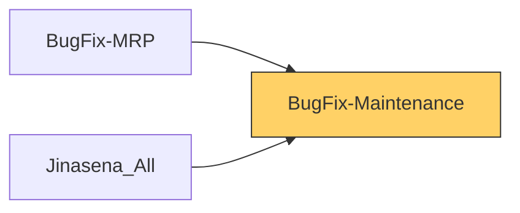

# Functional Documentation — BugFix-Maintenance

> Generated by `scripts/generate_functional_docs.py` from branch `Visual_Migration_02` (commit 2ab1499 2026-10-05) and the installed module on the clean environment. For every attribute: **Function** = what it does, **Depends on** = the attributes it relies on (owning module in brackets when it is not this repo), **Used by** = the attributes in any Jinasena repo that rely on it.

| Item | Value |
|---|---|
| Technical name | `BugFix-Maintenance` |
| Title | Jinasena : Module : Maintenance |
| Version | `17.0.0.0.18` |
| Category | Human Resources/Maintenance |
| License | LGPL-3 |
| Installed on environment | installed 17.0.0.0.18 |
| History | [CHANGELOG.md](CHANGELOG.md) |

## Purpose

<!-- SUMMARY:repo -->
BugFix-Maintenance is the Studio-to-Python port of Jinasena's Maintenance customizations. It is used by the maintenance and production teams who log equipment and raise maintenance requests, and it links maintenance to manufacturing work-center costing and to Material Requests in stores. It recreates on a fresh database the fields, views, server actions and automations that were built in Studio on the old system. Many of the ported workflow buttons were stripped during porting, so several server actions exist but are not reachable from the UI.

- Equipment: Electricity, Water and Lubricant figures on the equipment form, and an automation that sets each linked work center's Cost per Hour from its OT or labour cost per hour.
- Equipment categories: a Journal Type link on the category form and list.
- Maintenance requests: Diagnosis Details and Journal Type fields, a stage bar that cannot be clicked, list columns, and ported stage-change actions (Planning, In Progress with mandatory-field checks, Repaired, Scrap), Material Request creation and a check blocking Preventive type on manufacturing-linked requests.
- Maintenance stages: an ID column so users can see the stage ids used by the workflow actions.
- Journal Types: a new lookup model (x_journal_types) owned here and used by Accounting and Stock repos.
<!-- /SUMMARY -->

## Module dependencies

| Kind | Modules |
|---|---|
| Odoo standard / enterprise | `base_setup`, `maintenance`, `base_automation`, `mrp_maintenance` |
| Jinasena repos |  |
| Third-party apps |  |
| Used by (Jinasena repos that depend on this one) | `BugFix-MRP`, `Jinasena_All` |



## Contents at a glance

| Attribute type | Count |
|---|---|
| Models created | 1 |
| Models extended | 5 |
| Fields | 22 |
| Views | 11 |
| Window actions | 1 |
| Server actions | 15 |
| Automations | 3 |

## Models

| Model | Description | Created / extends | Fields | Views | Actions + automations | Approvals |
|---|---|---|---|---|---|---|
| `maintenance.equipment` | Maintenance Equipment | extends (maintenance) | 3 | 1 | 3 | 0 |
| `maintenance.equipment.category` | Maintenance Equipment Category | extends (maintenance) | 1 | 2 | 0 | 0 |
| `maintenance.mixin` | Maintenance Maintained Item | extends (maintenance) | 0 | 0 | 0 | 0 |
| `maintenance.request` | Maintenance Request | extends (maintenance) | 6 | 7 | 15 | 0 |
| `maintenance.stage` | Maintenance Stage | extends (maintenance) | 0 | 1 | 0 | 0 |
| `x_journal_types` | Journal Types | created | 12 | 0 | 0 | 0 |

### `maintenance.equipment` — Maintenance Equipment

*Extends a model created by `maintenance`.* Python: `models/maintenance_equipment.py`.

**Summary:**

<!-- SUMMARY:model:maintenance.equipment -->
This repo adds three manually entered figures to equipment, Electricity, Water and Lubricant, shown after Cost on the equipment form. An automation on create or update (Update Cost Per Hour in Work Center) finds every work center using the equipment and sets its Cost per Hour to its OT cost per hour when above zero, otherwise to its labour cost per hour. A second, duplicate copy of that server action is shipped but not linked to anything.
<!-- /SUMMARY -->

**Fields (3):**

| Field | Label | Type | Function | How it gets its value | Depends on | Used by |
|---|---|---|---|---|---|---|
| `x_studio_electricity` | Electricity | float | Electricity figure for the equipment, entered by the user next to Cost on the equipment form; not used by any logic in this repo. | stored |  | `view BugFix-Maintenance.view_5495_odoo_studio_equipment_form_customization_e` |
| `x_studio_lubricant` | Lubricant | float | Lubricant figure for the equipment, entered by the user next to Cost on the equipment form; not used by any logic in this repo. | stored |  | `view BugFix-Maintenance.view_5495_odoo_studio_equipment_form_customization_e` |
| `x_studio_water` | Water | float | Water figure for the equipment, entered by the user next to Cost on the equipment form; not used by any logic in this repo. | stored |  | `view BugFix-Maintenance.view_5495_odoo_studio_equipment_form_customization_e` |

**Server actions (2):**

- **Execute Code** (`server_action_2545_update_cost_per_hour_in_work_center`, type `code`)
  - Function: Run by the Update Cost Per Hour automation: for every work center using this equipment, sets Cost per Hour to its OT cost per hour if above zero, otherwise to its labour cost per hour.
  - Depends on: `model maintenance.equipment` (maintenance), `model mrp.workcenter` (mrp)
  - Used by: `automation BugFix-Maintenance.base_automation_251_update_cost_per_hour_in_work_center`
  <details><summary>code (10 lines)</summary>

```python

work_center = env['mrp.workcenter'].search([('equipment_ids', '=', record.id)])
if work_center:
  for work_centers in work_center:
    if work_centers.x_studio_ot_cost_per_hour > 0.00:
      #work_centers.write({'costs_hour':(work_centers.x_studio_overhead_cost_hour + work_centers.x_studio_general_cost_hour + work_centers.x_studio_ot_cost_per_hour)})
      work_centers.write({'costs_hour':(work_centers.x_studio_ot_cost_per_hour)}) 
    else:
      #Ework_centers.write({'costs_hour':(work_centers.x_studio_labour_cost_hour + work_centers.x_studio_overhead_cost_hour + work_centers.x_studio_general_cost_hour)}) 
      work_centers.write({'costs_hour':(work_centers.x_studio_labour_cost_hour)})
```
  </details>
- **Update Cost Per Hour in Work Center** (`sa_f5_maintenance_equipment_update_cost_per_hour_in_work_center`, type `code`)
  - Function: For the equipment, finds every work center using it and sets the work center Cost per Hour to its OT cost per hour when that is above zero, otherwise to its labour cost per hour. Duplicate of action 2545.
  - Depends on: `model maintenance.equipment` (maintenance), `model mrp.workcenter` (mrp)
  - Used by: — (not linked to a button, menu or automation)
  <details><summary>code (9 lines)</summary>

```python
work_center = env['mrp.workcenter'].search([('equipment_ids', '=', record.id)])
if work_center:
  for work_centers in work_center:
    if work_centers.x_studio_ot_cost_per_hour > 0.00:
      #work_centers.write({'costs_hour':(work_centers.x_studio_overhead_cost_hour + work_centers.x_studio_general_cost_hour + work_centers.x_studio_ot_cost_per_hour)})
      work_centers.write({'costs_hour':(work_centers.x_studio_ot_cost_per_hour)}) 
    else:
      #Ework_centers.write({'costs_hour':(work_centers.x_studio_labour_cost_hour + work_centers.x_studio_overhead_cost_hour + work_centers.x_studio_general_cost_hour)}) 
      work_centers.write({'costs_hour':(work_centers.x_studio_labour_cost_hour)})
```
  </details>
**Automations (1):**

| Name | Record name | State | Function | Depends on | Used by |
|---|---|---|---|---|---|
| Update Cost Per Hour in Work Center | `base_automation_251_update_cost_per_hour_in_work_center` |  | When a record is created or updated on Maintenance Equipment, runs _Execute Code_. | `model maintenance.equipment` (maintenance)<br>`server action BugFix-Maintenance.server_action_2545_update_cost_per_hour_in_work_center` |  |

**Views (1):**

| Name | Record name | Type | What it changes | Function | Depends on | Used by |
|---|---|---|---|---|---|---|
| Odoo Studio: equipment.form customization | `view_5495_odoo_studio_equipment_form_customization_e` | form | after `//field[@name='cost']`: add field x_studio_electricity, field x_studio_water, field x_studio_lubricant | Adds Electricity, Water and Lubricant fields after Cost on the maintenance equipment form. | `maintenance.equipment.x_studio_electricity`<br>`maintenance.equipment.x_studio_lubricant`<br>`maintenance.equipment.x_studio_water`<br>`view maintenance.hr_equipment_view_form` (maintenance) |  |

### `maintenance.equipment.category` — Maintenance Equipment Category

*Extends a model created by `maintenance`.* Python: `models/maintenance_equipment_category.py`.

**Summary:**

<!-- SUMMARY:model:maintenance.equipment.category -->
This repo adds a Journal Type link (to x_journal_types) to equipment categories. It is shown after the Responsible technician on the category form and as an optional column in the category list.
<!-- /SUMMARY -->

**Fields (1):**

| Field | Label | Type | Function | How it gets its value | Depends on | Used by |
|---|---|---|---|---|---|---|
| `x_studio_journal_type` | Journal Type | many2one → `x_journal_types` | Journal Type linked to an equipment category, chosen by the user on the category form and shown as an optional column in the category list. | stored | `model x_journal_types` | `view BugFix-Maintenance.ported_view_5332_odoo_studio_equipment_category_tree_cust`<br>`view BugFix-Maintenance.ported_view_5333_odoo_studio_equipment_category_form_cust` |

**Views (2):**

| Name | Record name | Type | What it changes | Function | Depends on | Used by |
|---|---|---|---|---|---|---|
| Odoo Studio: equipment.category.form customization | `ported_view_5333_odoo_studio_equipment_category_form_cust` | form | after `//field[@name='technician_user_id']`: add field x_studio_journal_type | Adds the Journal Type field after the Responsible technician on the equipment category form. | `maintenance.equipment.category.x_studio_journal_type`<br>`view maintenance.hr_equipment_category_view_form` (maintenance) |  |
| Odoo Studio: equipment.category.tree customization | `ported_view_5332_odoo_studio_equipment_category_tree_cust` | tree | after `//field[@name='technician_user_id']`: add field x_studio_journal_type | Adds an optional Journal Type column after the Responsible technician in the equipment category list. | `maintenance.equipment.category.x_studio_journal_type`<br>`view maintenance.hr_equipment_category_view_tree` (maintenance) |  |

### `maintenance.mixin` — Maintenance Maintained Item

*Extends a model created by `maintenance`.* Python: `models/maintenance_mixin.py`.

**Summary:**

<!-- SUMMARY:model:maintenance.mixin -->
Purpose not evident from code. The repo declares an empty Python extension of this abstract model, with no fields, methods or views.
<!-- /SUMMARY -->

### `maintenance.request` — Maintenance Request

*Extends a model created by `maintenance`.* Python: `models/maintenance_request.py`.

Other repos that use this model: `approval rule BugFix-Approvals.rule_83_maintenance_request_archive_equipment_request_user_types_int` (BugFix-Approvals)<br>`stock.picking.x_studio_maintenance_request_` (BugFix-Stock)<br>`x_material_request.x_studio_many2one_field_THFu6` (BugFix-Stock)<br>`x_mr_config.x_studio_many2one_field_6cvHX` (BugFix-Stock)

**Summary:**

<!-- SUMMARY:model:maintenance.request -->
This repo adds Diagnosis Details, a read-only Journal Type, and some unlabelled Studio fields to maintenance requests, plus two smart-button counters that were ported without a compute and always show 0. It ships ported Studio server actions that move a request between stages by fixed stage id (Planning, In Progress, Repaired, Scrap), with the MR versions checking that Priority, or Duration, Responsible, Scheduled Date and Diagnosis Details, are filled in. Other actions create a Material Request linked to the request (copying the Journal Type), generate the request reference from the mnt.req.seq sequence, and block Preventive type on manufacturing-linked requests; none of these are linked to a button, and the two automations (MNT code gen, Validate Maintenance Request) have no action linked, so they do nothing. The form views make the stage bar non-clickable, show the creator in place of the employee, and add list columns such as Description, Created on, Scheduled Date and Close Date.
<!-- /SUMMARY -->

**Fields (6):**

| Field | Label | Type | Function | How it gets its value | Depends on | Used by |
|---|---|---|---|---|---|---|
| `x_studio_diagnosis_details` | Diagnosis Details | text | Free-text diagnosis of the fault, entered on the request form under the label Diagnosis Details; the MR - Maintenance In progress action refuses to move the request to In Progress while it is empty. | stored |  | `server action BugFix-Maintenance.server_action_2318_mr_maintenance_in_progress`<br>`view BugFix-Maintenance.ported_view_3254_odoo_studio_equipment_request_form_custo` |
| `x_studio_float_field_hmeW9` | New Decimal | float | Unlabelled decimal ("New Decimal") shown after the Responsible user on the request form; entered manually and not used by any logic. | stored |  | `view BugFix-Maintenance.ported_view_3254_odoo_studio_equipment_request_form_custo` |
| `x_studio_integer_field_1Zbhs` | New Integer | integer | Unlabelled integer ("New Integer") with a default value of 0; not shown on any view or used by any logic in this repo. | stored |  | `default BugFix-Maintenance.default_387_maintenance_request_x_studio_integer_field_1Zbhs` |
| `x_studio_journal_type_1` | Journal Type | many2one → `x_journal_types` | Read-only Journal Type on a maintenance request; copied onto the Material Request created by the MR - Create MR from Maintenance Request action. | stored | `model x_journal_types` | `server action BugFix-Maintenance.server_action_2326_mr_create_mr_from_maintenance_request` |
| `x_x_studio_maintenance_request___stock_picking_count` | Maintenance Request # count | integer | Intended count of stock transfers linked to the request (Studio smart-button counter); ported as a plain non-stored integer with no compute, so it always shows 0. | not stored |  |  |
| `x_x_studio_many2one_field_THFu6__x_material_request_count` | MR | integer | Intended count of Material Requests linked to this maintenance request (Studio smart-button counter); ported as a plain non-stored integer with no compute, so it always shows 0. | not stored |  |  |

**Server actions (13):**

- **MNT code gen** (`server_action_1566_mnt_code_gen`, type `code`)
  - Function: Sets the maintenance request's Name (reference) to the next number from the `mnt.req.seq` sequence.
  - Depends on: `model ir.sequence` (base), `model maintenance.request` (maintenance)
  - Used by: — (not linked to a button, menu or automation)
  <details><summary>code (2 lines)</summary>

```python

record['name'] =env['ir.sequence'].next_by_code('mnt.req.seq')
```
  </details>
- **MNT_REQ_inprogress** (`server_action_1640_mnt_req_inprogress`, type `object_write`)
  - Function: Moves the maintenance request to stage ID 2 (In Progress) without any checks.
  - Depends on: `maintenance.request.stage_id` (maintenance), `model maintenance.request` (maintenance)
  - Used by: — (not linked to a button, menu or automation)
  <details><summary>code (12 lines)</summary>

```python
# Available variables:
#  - env: environment on which the action is triggered
#  - model: model of the record on which the action is triggered; is a void recordset
#  - record: record on which the action is triggered; may be void
#  - records: recordset of all records on which the action is triggered in multi-mode; may be void
#  - time, datetime, dateutil, timezone: useful Python libraries
#  - float_compare: utility function to compare floats based on specific precision
#  - log: log(message, level='info'): logging function to record debug information in ir.logging table
#  - _logger: _logger.info(message): logger to emit messages in server logs
#  - UserError: exception class for raising user-facing warning messages
#  - Command: x2many commands namespace
# To return an action, assign: action = {...}
```
  </details>
- **MNT_REQ_planing** (`server_action_1638_mnt_req_planing`, type `object_write`)
  - Function: Moves the maintenance request to stage ID 5 (Planning) without any checks.
  - Depends on: `maintenance.request.stage_id` (maintenance), `model maintenance.request` (maintenance)
  - Used by: — (not linked to a button, menu or automation)
  <details><summary>code (12 lines)</summary>

```python
# Available variables:
#  - env: environment on which the action is triggered
#  - model: model of the record on which the action is triggered; is a void recordset
#  - record: record on which the action is triggered; may be void
#  - records: recordset of all records on which the action is triggered in multi-mode; may be void
#  - time, datetime, dateutil, timezone: useful Python libraries
#  - float_compare: utility function to compare floats based on specific precision
#  - log: log(message, level='info'): logging function to record debug information in ir.logging table
#  - _logger: _logger.info(message): logger to emit messages in server logs
#  - UserError: exception class for raising user-facing warning messages
#  - Command: x2many commands namespace
# To return an action, assign: action = {...}
```
  </details>
- **MNT_REQ_repaired** (`server_action_1642_mnt_req_repaired`, type `object_write`)
  - Function: Moves the maintenance request to stage ID 3 (Repaired) without any checks.
  - Depends on: `maintenance.request.stage_id` (maintenance), `model maintenance.request` (maintenance)
  - Used by: — (not linked to a button, menu or automation)
  <details><summary>code (12 lines)</summary>

```python
# Available variables:
#  - env: environment on which the action is triggered
#  - model: model of the record on which the action is triggered; is a void recordset
#  - record: record on which the action is triggered; may be void
#  - records: recordset of all records on which the action is triggered in multi-mode; may be void
#  - time, datetime, dateutil, timezone: useful Python libraries
#  - float_compare: utility function to compare floats based on specific precision
#  - log: log(message, level='info'): logging function to record debug information in ir.logging table
#  - _logger: _logger.info(message): logger to emit messages in server logs
#  - UserError: exception class for raising user-facing warning messages
#  - Command: x2many commands namespace
# To return an action, assign: action = {...}
```
  </details>
- **MNT_REQ_scraped** (`server_action_1644_mnt_req_scraped`, type `object_write`)
  - Function: Moves the maintenance request to stage ID 4 (Scrap) without any checks.
  - Depends on: `maintenance.request.stage_id` (maintenance), `model maintenance.request` (maintenance)
  - Used by: — (not linked to a button, menu or automation)
  <details><summary>code (12 lines)</summary>

```python
# Available variables:
#  - env: environment on which the action is triggered
#  - model: model of the record on which the action is triggered; is a void recordset
#  - record: record on which the action is triggered; may be void
#  - records: recordset of all records on which the action is triggered in multi-mode; may be void
#  - time, datetime, dateutil, timezone: useful Python libraries
#  - float_compare: utility function to compare floats based on specific precision
#  - log: log(message, level='info'): logging function to record debug information in ir.logging table
#  - _logger: _logger.info(message): logger to emit messages in server logs
#  - UserError: exception class for raising user-facing warning messages
#  - Command: x2many commands namespace
# To return an action, assign: action = {...}
```
  </details>
- **MR - Create MR from Maintenance Request** (`server_action_2326_mr_create_mr_from_maintenance_request`, type `code`)
  - Function: Creates a Material Request linked to the maintenance request, copying its Journal Type. It builds an action to open the new MR but never assigns it to `action`, so nothing opens. Its form button was stripped during porting.
  - Depends on: `maintenance.request.x_studio_journal_type_1`, `model maintenance.request` (maintenance), `model x_material_request` (BugFix-Stock)
  - Used by: — (not linked to a button, menu or automation)
  <details><summary>code (27 lines)</summary>

```python
if record.id: 

  

  mr = env['x_material_request'].create({'x_studio_many2one_field_THFu6':record.id, 'x_studio_journal_type':record.x_studio_journal_type_1.id})  

  

  action = {

            'name': 'RFQ',

            'domain': [('id', '=', mr.id)],

            'type': 'ir.actions.act_window',

            'res_model': 'x_material_request',

            'view_mode': 'tree,form',

            'view_type': 'form',

            'view_id': False,

            'context': False,

            }
```
  </details>
- **MR - Maintenance In progress** (`server_action_2318_mr_maintenance_in_progress`, type `code`)
  - Function: Checks that Duration, Responsible, Scheduled Date and Diagnosis Details are filled in (raising an error otherwise), then moves the request to stage ID 2 (In Progress). Its form button was stripped during porting.
  - Depends on: `maintenance.request.duration` (maintenance), `maintenance.request.schedule_date` (maintenance), `maintenance.request.user_id` (maintenance), `maintenance.request.x_studio_diagnosis_details`, `model maintenance.request` (maintenance)
  - Used by: — (not linked to a button, menu or automation)
  <details><summary>code (15 lines)</summary>

```python
if record.id:
  if record.duration == False:
    raise UserError('Duration must be specified.')
    
  if record.user_id.id == False:
    raise UserError('Responsible user must be specified.')
    
  if record.schedule_date == False:
    raise UserError('Schedule date must be specified.')
    
  if record.x_studio_diagnosis_details == False:
    raise UserError('Diagnosis details must be specified.')  
    
    
  record.write({'stage_id':2})
```
  </details>
- **MR - Maintenance Planning** (`server_action_2320_mr_maintenance_planning`, type `code`)
  - Function: Raises an error if Priority is not set, otherwise moves the maintenance request to stage ID 5 (Planning). Its form button was stripped during porting.
  - Depends on: `maintenance.request.priority` (maintenance), `model maintenance.request` (maintenance)
  - Used by: — (not linked to a button, menu or automation)
  <details><summary>code (5 lines)</summary>

```python
if record.id:
  if record.priority == False:
    raise UserError('Priority level must be defined.')
    
  record.write({'stage_id':5})
```
  </details>
- **MR - Maintenance Repaired** (`server_action_2322_mr_maintenance_repaired`, type `object_write`)
  - Function: Moves the maintenance request to stage ID 3 (Repaired). Its header button was stripped from the form during porting, so it is not reachable from the UI.
  - Depends on: `maintenance.request.stage_id` (maintenance), `model maintenance.request` (maintenance)
  - Used by: — (not linked to a button, menu or automation)
  <details><summary>code (12 lines)</summary>

```python
# Available variables:
#  - env: environment on which the action is triggered
#  - model: model of the record on which the action is triggered; is a void recordset
#  - record: record on which the action is triggered; may be void
#  - records: recordset of all records on which the action is triggered in multi-mode; may be void
#  - time, datetime, dateutil, timezone: useful Python libraries
#  - float_compare: utility function to compare floats based on specific precision
#  - log: log(message, level='info'): logging function to record debug information in ir.logging table
#  - _logger: _logger.info(message): logger to emit messages in server logs
#  - UserError: exception class for raising user-facing warning messages
#  - Command: x2many commands namespace
# To return an action, assign: action = {...}
```
  </details>
- **MR - Maintenance Scrap** (`server_action_2324_mr_maintenance_scrap`, type `object_write`)
  - Function: Moves the maintenance request to stage ID 4 (Scrap).
  - Depends on: `maintenance.request.stage_id` (maintenance), `model maintenance.request` (maintenance)
  - Used by: — (not linked to a button, menu or automation)
  <details><summary>code (12 lines)</summary>

```python
# Available variables:
#  - env: environment on which the action is triggered
#  - model: model of the record on which the action is triggered; is a void recordset
#  - record: record on which the action is triggered; may be void
#  - records: recordset of all records on which the action is triggered in multi-mode; may be void
#  - time, datetime, dateutil, timezone: useful Python libraries
#  - float_compare: utility function to compare floats based on specific precision
#  - log: log(message, level='info'): logging function to record debug information in ir.logging table
#  - _logger: _logger.info(message): logger to emit messages in server logs
#  - UserError: exception class for raising user-facing warning messages
#  - Command: x2many commands namespace
# To return an action, assign: action = {...}
```
  </details>
- **MR create For MNT** (`server_action_1649_mr_create_for_mnt`, type `code`)
  - Function: Creates a new Material Request linked to the current maintenance request. Duplicate of action 1646.
  - Depends on: `model maintenance.request` (maintenance), `model x_material_request` (BugFix-Stock)
  - Used by: — (not linked to a button, menu or automation)
  <details><summary>code (1 lines)</summary>

```python
env['x_material_request'].create({'x_studio_many2one_field_THFu6':record.id })
```
  </details>
- **MR create For MNT** (`server_action_1646_mr_create_for_mnt`, type `code`)
  - Function: Creates a new Material Request linked to the current maintenance request. Duplicate of action 1649.
  - Depends on: `model maintenance.request` (maintenance), `model x_material_request` (BugFix-Stock)
  - Used by: — (not linked to a button, menu or automation)
  <details><summary>code (1 lines)</summary>

```python
env['x_material_request'].create({'x_studio_many2one_field_THFu6':record.id })
```
  </details>
- **Validate Maintenance  Request** (`server_action_1637_validate_maintenance_request`, type `code`)
  - Function: Blocks a request linked to a manufacturing order from using the Preventive maintenance type by raising an error.
  - Depends on: `maintenance.request.maintenance_type` (maintenance), `maintenance.request.production_id` (mrp_maintenance), `model maintenance.request` (maintenance)
  - Used by: — (not linked to a button, menu or automation)
  <details><summary>code (3 lines)</summary>

```python
if record.production_id.id:
  if record.maintenance_type == 'preventive':
    raise UserError('Preventive Maintenance Type is not Allowed for Manufacture Related Requests.')
```
  </details>
**Automations (2):**

| Name | Record name | State | Function | Depends on | Used by |
|---|---|---|---|---|---|
| MNT code gen | `automation_96_mnt_code_gen` |  | When a record is created or updated on Maintenance Request, runs nothing (no action linked). | `model maintenance.request` (maintenance) |  |
| Validate Maintenance  Request | `automation_97_validate_maintenance_request` |  | When a record is created or updated on Maintenance Request, runs nothing (no action linked). | `model maintenance.request` (maintenance) |  |

**Window actions (1):**

| Name | Record name | Function | Depends on | Used by |
|---|---|---|---|---|
| Maintenance Requests | `act_window_668_maintenance_requests` | Opens **Maintenance Request** records (kanban,tree,form,pivot,graph,calendar,activity), filtered to `[('maintenance_team_id', '=', active_id), ('maintenance_type', 'in', context.get('maintenance_type', ['preventive', 'corrective']))]`. | `maintenance.request.maintenance_team_id` (maintenance)<br>`maintenance.request.maintenance_type` (maintenance)<br>`model maintenance.request` (maintenance) |  |

**Views (7):**

| Name | Record name | Type | What it changes | Function | Depends on | Used by |
|---|---|---|---|---|---|---|
| Default activity view for ir.model(689,) | `ported_default_activity_vie_a2229fc7_c68c_4499_8d6d_40f805c9f25d` | activity | full activity layout with 1 fields | Activity view for maintenance requests that shows each request by its Name. Duplicate of view 3771. | `maintenance.request.name` (maintenance) |  |
| Default activity view for ir.model(689,) | `view_3771_default_activity_view_for_ir_model_689_e` | activity | full activity layout with 1 fields | Activity view for maintenance requests that shows each request by its required Name. Duplicate of the ported activity view. | `maintenance.request.name` (maintenance) |  |
| Odoo Studio: equipment.request.form customization | `ported_odoo_studio_equipmen_d67f3394_a9ef_4052_87b7_48d8f04b6c20` | form | before `//form[1]/sheet[1]/div[not(@name)][1]`: add div | Adds an empty smart-button box at the top of the maintenance request form; it has no visible effect on its own. | `view maintenance.hr_equipment_request_view_form` (maintenance) |  |
| Odoo Studio: equipment.request.form customization | `ported_view_3254_odoo_studio_equipment_request_form_custo` | form | inside `//sheet`: add field stage_id; replace `//field[@name='employee_id']`: add field create_uid; set studio_approval=False on `//button[@name='archive_equipment_request']`; before `//form[1]/sheet[1]/div[not(@name)][1]`: add div; set force_save=True, readonly=1 on `//field[@name='name']`; set readonly=(stage_id == 4) or ((stage_id == 3) or ((stage_id == 2) or (stage_id == 5))) on `//field[@name='equipment_id']`; set readonly=(stage_id == 4) or ((stage_id == 3) or ((stage_id == 2) or (stage_id == 5))) on `//field[@name='maintenance_type']`; set force_save=True, readonly=1 on `//field[@name='production_id']` … | Main request form customization: replaces Employee with Created by and makes Name and Manufacturing Order read-only. Locks equipment, type, team, responsible, dates, duration and priority by stage, and hides team, responsible, schedule and duration in stage 1. Priority becomes a required radio, and Description is swapped for Diagnosis Details. | `maintenance.request.stage_id` (maintenance)<br>`maintenance.request.x_studio_diagnosis_details`<br>`maintenance.request.x_studio_float_field_hmeW9`<br>`view maintenance.hr_equipment_request_view_form` (maintenance) |  |
| Odoo Studio: equipment.request.tree customization | `view_5318_odoo_studio_equipment_request_tree_customization_e` | tree | after `//tree[1]/field[@name='name']`: add field description, field create_date; after `//field[@name='request_date']`: add field schedule_date, field close_date | Adds optional Description and Created on columns after the request name, and Scheduled Date and Close Date after Request Date, in the maintenance request list. | `maintenance.request.close_date` (maintenance)<br>`maintenance.request.description` (maintenance)<br>`maintenance.request.schedule_date` (maintenance)<br>`view maintenance.hr_equipment_request_view_tree` (maintenance) |  |
| equipment.request.form_Button | `ported_view_5072_equipment_request_form_button` | form | after `//header/button[@name='archive_equipment_request']`: add ; set options={'clickable': False} on `//field[@name='stage_id']` | Stops users from changing stage by clicking the statusbar on the maintenance request form. The workflow buttons it originally added (Planning, In Progress, Create MR, Repaired) were stripped during porting. | `view maintenance.hr_equipment_request_view_form` (maintenance) |  |
| equipment.request.form_Button | `view_5072_equipment_request_form_button_e` | form | after `//header/button[@name='archive_equipment_request']`: add ; set options={'clickable': False} on `//field[@name='stage_id']` | Stops users from changing stage by clicking the statusbar on the maintenance request form. Its workflow buttons were stripped as unresolvable. Duplicate of ported view 5072. | `view maintenance.hr_equipment_request_view_form` (maintenance) |  |

### `maintenance.stage` — Maintenance Stage

*Extends a model created by `maintenance`.*

**Summary:**

<!-- SUMMARY:model:maintenance.stage -->
This repo only adds an optional ID column to the maintenance stage list, so users can see the stage ids that the maintenance request workflow actions use.
<!-- /SUMMARY -->

**Views (1):**

| Name | Record name | Type | What it changes | Function | Depends on | Used by |
|---|---|---|---|---|---|---|
| Odoo Studio: equipment.stage.tree customization | `ported_view_5071_odoo_studio_equipment_stage_tree_customi` | tree | after `//field[@name='done']`: add field id | Adds an optional ID column to the maintenance stage list, so users can see the stage IDs used by the workflow actions. | `view maintenance.hr_equipment_stage_view_tree` (maintenance) |  |

### `x_journal_types` — Journal Types

*Created by this repo.* Python: `models/x_journal_types.py`. Record name field: `x_name`.

Other repos that use this model: `access right BugFix-Accounting.access_5950_journal_types_group_system` (BugFix-Accounting)<br>`access right BugFix-Accounting.access_5951_journal_types_group_user` (BugFix-Accounting)<br>`access right BugFix-Stock.access_x_journal_types_user` (BugFix-Stock)<br>`automation BugFix-Accounting.base_automation_337_jin_company_id_in_journal_types` (BugFix-Accounting)<br>`record rule BugFix-Accounting.rule_629_jin_multi_company_journal_types` (BugFix-Accounting)<br>`server action BugFix-Accounting.sa_f5_x_journal_types_jin_company_id_in_journal_types` (BugFix-Accounting)<br>`server action BugFix-Accounting.server_action_2871_jin_company_id_in_journal_types` (BugFix-Accounting)<br>`server action BugFix-Stock.server_action_2448_movement_journals_update_offset_account` (BugFix-Stock)<details><summary>+3 more</summary>`stock.picking.x_studio_journal_type` (BugFix-Stock)<br>`window action BugFix-Accounting.action_2447_journal_types` (BugFix-Accounting)<br>`x_material_request.x_studio_journal_type` (BugFix-Stock)</details>

**Summary:**

<!-- SUMMARY:model:x_journal_types -->
A Journal Type is a company-specific lookup record with a name, description, offset accounting account, sequence and active flag. It is linked from equipment categories and maintenance requests, and copied onto Material Requests created from a maintenance request. The model is created in this repo, while its list and form views, defaults, access rights, multi-company record rule and the automation that fills the company live in BugFix-Accounting, and BugFix-Stock also grants access to it.
<!-- /SUMMARY -->

**Fields (12):**

| Field | Label | Type | Function | How it gets its value | Depends on | Used by |
|---|---|---|---|---|---|---|
| `create_date` | Created on | datetime | Date and time the Journal Type was created, set automatically; used as the trigger field of the automation that fills in the company. | stored |  | `automation BugFix-Accounting.base_automation_337_jin_company_id_in_journal_types` (BugFix-Accounting) |
| `create_uid` | Created by | many2one → `res.users` | User who created the Journal Type record, set automatically. | stored | `model res.users` (base) |  |
| `display_name` | Display Name | char | Name shown for the Journal Type in dropdowns and links, computed by Odoo from the record name. | not stored |  |  |
| `id` | ID | integer | Technical database ID of the Journal Type record. | stored |  |  |
| `write_date` | Last Updated on | datetime | Date and time the Journal Type was last modified, set automatically. | stored |  |  |
| `write_uid` | Last Updated by | many2one → `res.users` | User who last modified the Journal Type record, set automatically. | stored | `model res.users` (base) |  |
| `x_active` | Active | boolean | Archive flag for a Journal Type; when unchecked the record is hidden and appears only under the Archived filter. | stored |  | `default BugFix-Accounting.default_390_x_journal_types_x_active` (BugFix-Accounting)<br>`view BugFix-Accounting.ported_view_5321_default_form_view_fo_dbddc8a1_ea9d_47ba_8335_c08e4a53fc5c` (BugFix-Accounting)<br>`view BugFix-Accounting.ported_view_5322_default_search_view_d3c181ad_9bc3_4cfc_9d60_2500bd38fe9f` (BugFix-Accounting) |
| `x_name` | Journal Type | char | Name of the Journal Type, entered by the user; used as the record's display name in lists, forms and search. | stored; required |  | `view BugFix-Accounting.ported_view_5320_default_list_view_fo_02152264_7fd7_4b5e_8a84_ca3714db9fad` (BugFix-Accounting)<br>`view BugFix-Accounting.ported_view_5321_default_form_view_fo_dbddc8a1_ea9d_47ba_8335_c08e4a53fc5c` (BugFix-Accounting)<br>`view BugFix-Accounting.ported_view_5322_default_search_view_d3c181ad_9bc3_4cfc_9d60_2500bd38fe9f` (BugFix-Accounting) |
| `x_studio_company_id` | Company | many2one → `res.company` | Company that owns the Journal Type; filled automatically by a server action after creation and used by a multi-company record rule to limit visibility. | stored | `model res.company` (base) | `record rule BugFix-Accounting.rule_629_jin_multi_company_journal_types` (BugFix-Accounting)<br>`server action BugFix-Accounting.sa_f5_x_journal_types_jin_company_id_in_journal_types` (BugFix-Accounting)<br>`server action BugFix-Accounting.server_action_2871_jin_company_id_in_journal_types` (BugFix-Accounting)<br>`view BugFix-Accounting.ported_view_5326_odoo_studio_default_7879380a_9ecc_4ca6_bfd3_fa82b991c3ce` (BugFix-Accounting) |
| `x_studio_description` | Description | char | Free-text description of the Journal Type, entered on its form. | stored |  | `view BugFix-Accounting.ported_view_5326_odoo_studio_default_7879380a_9ecc_4ca6_bfd3_fa82b991c3ce` (BugFix-Accounting) |
| `x_studio_offset_account` | Offset Account | many2one → `account.account` | Accounting account used as the offset account for this Journal Type, chosen on its form. | stored | `model account.account` (account) | `view BugFix-Accounting.ported_view_5326_odoo_studio_default_7879380a_9ecc_4ca6_bfd3_fa82b991c3ce` (BugFix-Accounting) |
| `x_studio_sequence` | Sequence | integer | Ordering number for Journal Types (drag handle in the list), with a default value. | stored |  | `default BugFix-Accounting.default_391_x_journal_types_x_studio_sequence` (BugFix-Accounting)<br>`view BugFix-Accounting.ported_view_5320_default_list_view_fo_02152264_7fd7_4b5e_8a84_ca3714db9fad` (BugFix-Accounting) |

## Data records loaded (1)

Records this module creates on install (lookup values, sequences, defaults, companies, users …).

| Type | Record name | Function | Depends on | Used by |
|---|---|---|---|---|
| `ir.default` | `default_387_maintenance_request_x_studio_integer_field_1Zbhs` | Sets the default of **New Integer (Maintenance Request)** to `"0"`. | `maintenance.request.x_studio_integer_field_1Zbhs` |  |

## Depends on other modules' attributes

Everything of other modules that this repo's attributes rely on. If one of these is removed or changed, this repo is affected.

| Module | Kind | Count | Attributes |
|---|---|---|---|
| `BugFix-Stock` | Jinasena repo | 1 | model x_material_request |
| `account` | Odoo | 1 | model account.account |
| `base` | Odoo | 3 | model ir.sequence, model res.company, model res.users |
| `maintenance` | Odoo | 21 | maintenance.request.close_date, maintenance.request.description, maintenance.request.duration, maintenance.request.maintenance_team_id, maintenance.request.maintenance_type, maintenance.request.name, maintenance.request.priority, maintenance.request.schedule_date, maintenance.request.stage_id, maintenance.request.user_id, model maintenance.equipment, model maintenance.equipment.category, model maintenance.mixin, model maintenance.request, model maintenance.stage, view maintenance.hr_equipment_category_view_form, view maintenance.hr_equipment_category_view_tree, view maintenance.hr_equipment_request_view_form, view maintenance.hr_equipment_request_view_tree, view maintenance.hr_equipment_stage_view_tree, view maintenance.hr_equipment_view_form |
| `mrp` | Odoo | 1 | model mrp.workcenter |
| `mrp_maintenance` | Odoo | 1 | maintenance.request.production_id |

## Used by other repos

This repo's attributes that other Jinasena repos rely on. Changing or removing one of these affects that repo.

| Repo | Kind | Count | This repo's attributes they use |
|---|---|---|---|
| `BugFix-Accounting` | Jinasena repo | 7 | x_journal_types.create_date, x_journal_types.x_active, x_journal_types.x_name, x_journal_types.x_studio_company_id, x_journal_types.x_studio_description, x_journal_types.x_studio_offset_account, x_journal_types.x_studio_sequence |
